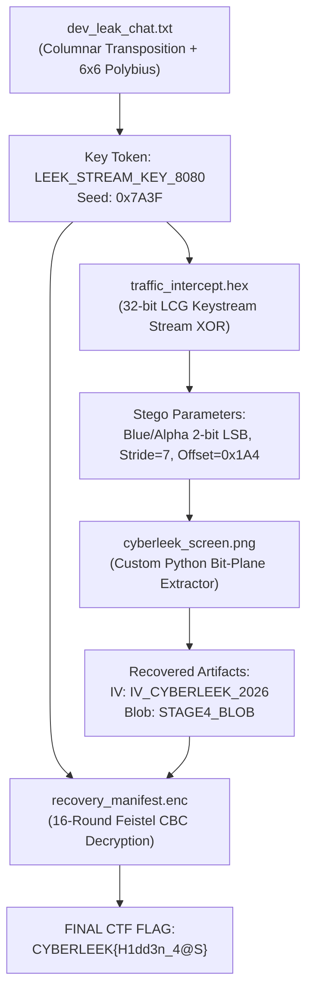

# Round 02: What the Image Remembered / The Hidden Signal
**Domain:** Cryptography & Steganography
**Theme:** CYBERLEEK — August 2026 GTA VI Developer Asset Leak
**Tagline:** *"The original disappeared. The pixels didn't."*

---

## 1. Objective

Participants take on the role of digital forensic investigators analyzing leaked internal materials from the August 2026 GTA VI security breach associated with $CYBERLEEK. The objective is to unravel a four-stage cryptographic and steganographic investigation chain. By solving each forensic level, investigators recover intermediate key credentials that unlock subsequent evidence files, culminating in the recovery and decryption of the single authoritative Case Resolution Token:

**Final CTF Flag Format:**
```text
CYBERLEEK{H1dd3n_4@S}
```

---

## 2. Chained Progression Matrix

| Level | Title | Category | Difficulty | Target Solve Time | Core Concept | Result / Artifact Produced |
| :--- | :--- | :--- | :--- | :--- | :--- | :--- |
| **Level 2.1** | Leaked Developer Chat | Cryptography | Easy / Medium | 7–10 min | Columnar Transposition (`VICE`) + 6x6 Polybius Substitution | **Key Token:** `LEEK_STREAM_KEY_8080`<br>**Seed:** `0x7A3F` |
| **Level 2.2** | Intercepted Stream Telemetry | Cryptography | Medium | 8–12 min | 32-bit LCG Keystream Stream XOR Decryption | **Steganography Parameters:**<br>- Blue & Alpha 2-bit LSB interleaved<br>- Stride = 7 pixels, Offset = `0x1A4` |
| **Level 2.3** | Developer Screen / Hidden Signal | Steganography | Hard | 12–15 min | Custom 2-bit Blue/Alpha pixel plane extraction | **Vector:** `IV_CYBERLEEK_2026`<br>**Encrypted Blob:** `STAGE4_BLOB` |
| **Level 2.4** | Final Synthesis & Decryption | Modern Cryptography | Hard | 8–10 min | 16-Round Feistel Block Cipher Decryption in CBC Mode | **FINAL CTF FLAG:**<br>`CYBERLEEK{H1dd3n_4@S}` |

*Total Estimated Solve Time:* **35–45 minutes** (Requires custom Python scripts; single-click automated tools fail by design).

---

## 3. Expected Solve Flow & Cryptographic Chaining



### Detailed Solve Sequence

1. **Level 2.1 (`dev_leak_chat.txt`)**:
   - The developer chat discusses an asset verification payload obfuscated with a two-stage cipher: 6x6 Polybius matrix followed by Columnar Transposition with keyword `VICE`.
   - Reverse the Columnar Transposition (keyword length 4, order `C`, `E`, `I`, `V`) to reorder the 72 digits into 18 rows.
   - Group the digits into coordinate pairs and look up characters in the 6x6 Polybius square (A–Z with I/J merged, 0–9, and `_`).
   - Plaintext yields: `KEY_LEEK_STREAM_KEY_8080_SEED_0X7A3F`.
   - Recover **Key Token:** `LEEK_STREAM_KEY_8080` and **Seed:** `0x7A3F`.

2. **Level 2.2 (`traffic_intercept.hex`)**:
   - Convert hex stream to binary bytes.
   - Initialize 32-bit LCG state with seed `0x7A3F` and update state with each byte of `LEEK_STREAM_KEY_8080` via polynomial rolling hash:
     $$\text{state} = (\text{state} \cdot 31 + \text{byte}) \pmod{2^{32}}$$
   - Generate keystream bytes via $(X_{n+1} \gg 16) \ \& \ 0\text{xFF}$ using recurrence $X_{n+1} = (1664525 \cdot X_n + 1013904223) \pmod{2^{32}}$.
   - Decrypt hex stream with keystream XOR to reveal extraction parameters for `cyberleek_screen.png`:
     - Interleaved 2-bit LSB across Blue and Alpha channels
     - Stride = 7 pixels
     - Offset = `0x1A4` (420 decimal)

3. **Level 2.3 (`cyberleek_screen.png`)**:
   - Inspect the authentic GTA VI Vice City developer debug wireframe image (1280x720 RGBA).
   - Write a custom Python script using Pillow to read pixel pairs starting at offset `0x1A4` with stride `7`.
   - Each byte is reconstructed from 2 pixels (Blue and Alpha 2-bit LSBs).
   - Automated tools like `zsteg` fail completely because of the non-zero offset, non-unit stride, and multi-channel interleaving.
   - Recover payload recovering:
     - Vector identifier: `IV_CYBERLEEK_2026`
     - Ciphertext blob: `STAGE4_BLOB` (32 bytes, identical to `recovery_manifest.enc`)

4. **Level 2.4 (`recovery_manifest.enc`)**:
   - The encrypted manifest file `recovery_manifest.enc` is protected by a 16-round Feistel-style block cipher in CBC mode.
   - Subkeys are generated using SHA-256 over the Level 1 Key Token (`LEEK_STREAM_KEY_8080`) and Level 3 IV (`IV_CYBERLEEK_2026`).
   - Invert the Feistel rounds and remove PKCS7 padding to recover the official flag:
     ```text
     CYBERLEEK{H1dd3n_4@S}
     ```

---

## 4. Post-Round Transition Message

> *"You found the signal. Now find the system that carried it."*

---

## 5. Initial Player File Distribution

Initially distributed participant package contains **EXACTLY** these files under `round2/user/`:

```text
user/
├── ROUND2_PARTICIPANT_PREREQUISITES.md
├── level1/
│   ├── challenge.md
│   └── files/
│       └── dev_leak_chat.txt
├── level2/
│   ├── challenge.md
│   └── files/
│       └── traffic_intercept.hex
├── level3/
│   ├── challenge.md
│   └── files/
│       └── cyberleek_screen.png
└── level4/
    ├── challenge.md
    └── files/
        └── recovery_manifest.enc
```

### Participant Links
- **Tooling & Setup Guide:** [user/ROUND2_PARTICIPANT_PREREQUISITES.md](user/ROUND2_PARTICIPANT_PREREQUISITES.md)
- **Level 2.1:** [Challenge Brief](user/level1/challenge.md) | [Evidence File](user/level1/files/dev_leak_chat.txt)
- **Level 2.2:** [Challenge Brief](user/level2/challenge.md) | [Evidence File](user/level2/files/traffic_intercept.hex)
- **Level 2.3:** [Challenge Brief](user/level3/challenge.md) | [Evidence File](user/level3/files/cyberleek_screen.png)
- **Level 2.4:** [Challenge Brief](user/level4/challenge.md) | [Evidence File](user/level4/files/recovery_manifest.enc)

> [!IMPORTANT]
> - All intermediate credentials and extraction parameters must be derived sequentially.
> - Automated single-click tools will not work; participants must implement custom Python logic.
> - No solution files, generators, or organizer assets are distributed to players.

---

## 6. Participant Prerequisites

Participants require a standard security / forensics environment (Kali Linux, Ubuntu, WSL2, or macOS/Windows with necessary tools):

- **Python 3** (with standard libraries: `hashlib`, `re`)
- **Pillow (PIL)** (`pip install Pillow`) for RGBA bit-plane manipulation
- Review full prerequisites in [user/ROUND2_PARTICIPANT_PREREQUISITES.md](user/ROUND2_PARTICIPANT_PREREQUISITES.md).

---

## 7. Organizer Notes & Verification

1. **Strict Admin vs. User Decoupling:** Round 02 features complete structural separation between participant artifacts (`round2/user/`) and organizer tooling/solutions (`round2/admin/`).
2. **Platform Compliance Rules:** Review backend scoring, rate limits, and disqualification rules in [admin/PRODUCTION_SUBMISSION_RULES.md](admin/PRODUCTION_SUBMISSION_RULES.md).
3. **Organizer Level Walkthroughs & Solvers:**
   - **Level 2.1:** [admin/level1/main.md](admin/level1/main.md)
   - **Level 2.2:** [admin/level2/main.md](admin/level2/main.md)
   - **Level 2.3:** [admin/level3/main.md](admin/level3/main.md)
   - **Level 2.4:** [admin/level4/main.md](admin/level4/main.md)
4. **Deterministic Cryptographic Pipeline:** All challenge artifacts can be regenerated reproducibly using scripts in `round2/admin/levelX/src/`.
5. **Automated Verification:** The complete 12-test validation suite can be executed from `round2/admin/`:
   ```bash
   cd round2/admin
   python test_round2_chain.py
   ```
   Inspect test suite implementation: [admin/test_round2_chain.py](admin/test_round2_chain.py).
6. **Bundle Generation & Integrity Audit:** Create distribution-ready zip bundles with zero-leak assertions:
   ```bash
   cd round2/admin
   python build_bundles.py
   ```
   Inspect packaging utility: [admin/build_bundles.py](admin/build_bundles.py).
